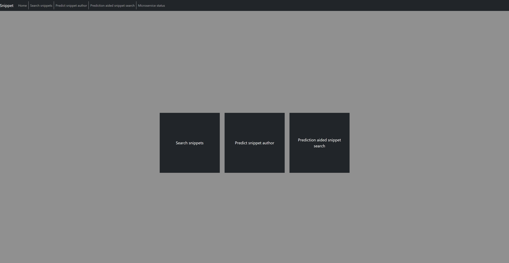

# Snippet App

## Project Description

This app reads provided books from www.gutenberg.org, and then parses them into snippets.
Provides searching functionality, allowing search by snippet text, book and author.
The app can also predict author of a snippet based on passed snippet text using machine learning as well as use that prediction to better search for a snippet.
There is a text summarizer included that gives summaries of snippets.
All this functionality is open through a REST API and displayed on a web page that uses said API.

### Technologies used

* **Lucene library**: for indexing and searching through snippets lucene library is used.

* **Weka library**: Machine learning is done using the weka library. 

* **Text representation**: The arff files created after parsing are filter throug StringToWordVector filter twice seperatly to get bag-of-words representation of snippets.
The snippets are represented through 5-2 word n-grams and 3-1 character n-grams.

* **Classifer**: Two sepreate SMO classifiers are trained on these representations.
In the end a new weigted soft voting classifier is made using these two which is then evaluated on the test set, and used in the future for predicting authors of snippets.

* **Spring Framework**: Spring is used for the REST API and for connecting the many microservices.

* **PostgresSQL**: PostgresSQL is used as the main database of the project.
* **Microservice architecture**: The app uses microservice architecture with 4 microservices and the summarizer API.
There is a main microservice that communicates to all others and exposes the REST API.
* **React**: React is used to make the web app.

## Getting started
The app is dockerized, so it can easily be run using docker. 
On each running of the app the parser microservice will check if all snippets are contained within the database.
The parser checks snippets against their hash value and will add any that are missing.

Classification service will train the model after the parser finishes unless it detects a pretrained model already exists.
Because of the long time needed for training the model this repo comes with a pretrained model.

Indexer service will start indexing snippets at the same time as the classification service.

### Starting the app
To run the project you will need docker and docker-compose. In the project root folder run the following command:

	docker-compose up --build
	
The app will start and be accessible at `http://localhost:3000`.

> **Note:** Make sure that docker engine is running before executing the command.

> **Note 2:** The app needs some time to check data integrity, index snippets and load classifier some functionality will be unavailable during that process.

> **Note 3:** During initial start up a lot of time needs to pass for all snippets to be sent into the database (around 10 minutes)

## Need help?
If you need help please file a new issue under the issues tab.

## Contributing
For details on how to contribute please check [CONTRIBUTING.md](CONTRIBUTING.md) file.

## Author
* **Nikola Radojčić** - [Nikolar1](https://github.com/Nikolar1)

## Versioning 
We use [SemVer](https://semver.org/) versioning.

## License
This project is licensed under the MIT License - see the [LICENSE.md](LICENSE.md) file for details.

## Code of Conduct 
For details on the code of conduct please check [CODE_OF_CONDUCT.md](CODE_OF_CONDUCT.md)
## Screenshots

### Home page

### Search page

### Author prediction page

### Prediction aided search page

### Status page
